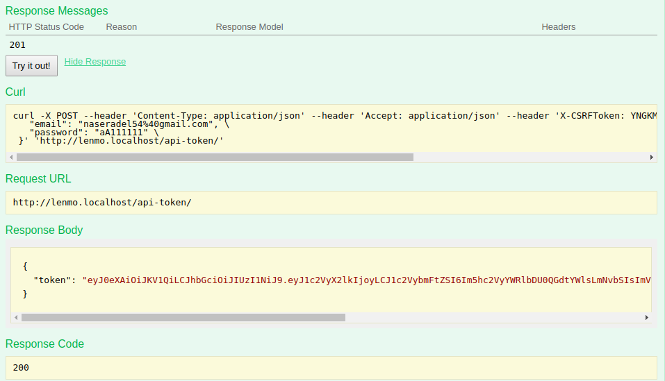
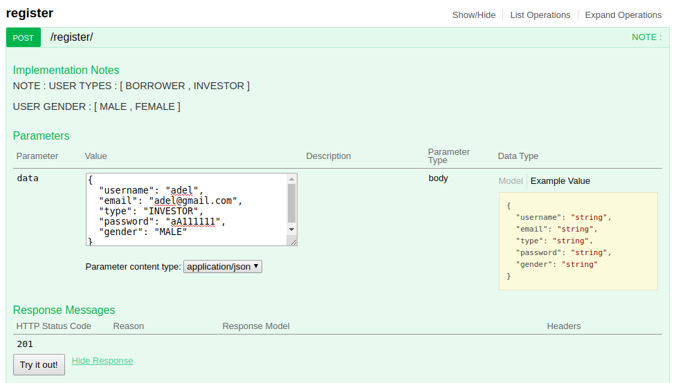

# Lenmo-Test
Use case\
\
A Lenmo borrower would like to borrower $5,000.00 on paying them back on 6 months period. One of Lenmo investors has offered him 15% Annual Interest Rate. A $3.00 Lenmo fee will be added to the total loan amount to be paid by the investor.  
 
Requirements:
You are required to develop a Django REST project to be able to build the following flow through its APIs;
 
1-The borrower creates a loan request including the above loan amount and loan period 
2-The investor will submit an offer for the borrower’s loan request with the above interest rate
3-The borrower will accept the offer
Check if the investor has sufficient balance in their account before they fund the loan
4-The loan will be funded successfully and the loan status will be Funded 
5-The loan payments will be created with the monthly amount to be paid and its due date
6-Once all the payments are successfully paid to the investor, the loan status will be Completed 


# *To run Project*

## First
install Docker on your machine you can follow the steps [here](https://docs.docker.com/install/linux/docker-ce/ubuntu/).

## Second 


cd to folder of project 

- ``` cd LenmoTest```
-  ```docker-compose  up --build``` 

if open project for first time use "*```docker-compose  up --build```*" , if you use it before without change the 
 setting of docker file
 or docker-compose you can just use "*```docker-compose  up```*" 
 
 ## after run project
 -  open your browser and type [lenmo.localhost](lenmo.localhost)
 - the project will open on swagger documentation of APIS
 
 # Note  1
 ## You won't see anything of API'S Until Authenticate who you are 
 
 # Note  2
 ## CELERY task run in background and print messages like send email to user just simulate the situation 
 
 ## 10 type of user exist [BORROWER , INVESTOR ]
 ## when yo login as  *BORROWER* you can use only API'S belong to  *BORROWER* and  when yo login as *INVESTOR* you can use only API'S belong to *INVESTOR*
 

 # use case
 #### first you need make two account one as *borrower* and second as investor 
 
 - open your browser  after run docker-compose and type [lenmo.localhost](lenmo.localhost)
 
 
 
 -  make BORROWER account from register
 


- after register save token of user to use it or you can get it by email and password from api-token link



-  make INVESTOR account from register


- after register save token of user to use it or you can get it by email and password from api-token link


-  use authorize button to authorize your self and use api's

- we use JWT authentication 

- use your token like this
```JWT eyJ0eXAiOiJKV1QiLCJhbGciOi```
- and click on authorize button


- you will find API's appear for BORROWER


-use rhe same steps for INVESTOR get INVESTOR token and authorize by it and you will find INVESTOR APIS


# finally open API'S links and test it 
- like this


# Apply Use Case
- first the *BORROWER* make the loan request


- the investor can only get all loan requests just loan amount and period and the user request the loan 


- investor can creat offer to loan request by take loan request id from the loans url api and enter the interest rate


- borrower can expand all loan requests if any investor create offer to his loan he can saw it 


- if borrower need to accept offer take the offer id from my_loans url and accept offer


- after accept the status of loan changed and create the loan payments and change the offer status


- if borrower or investor need to deposit money 


